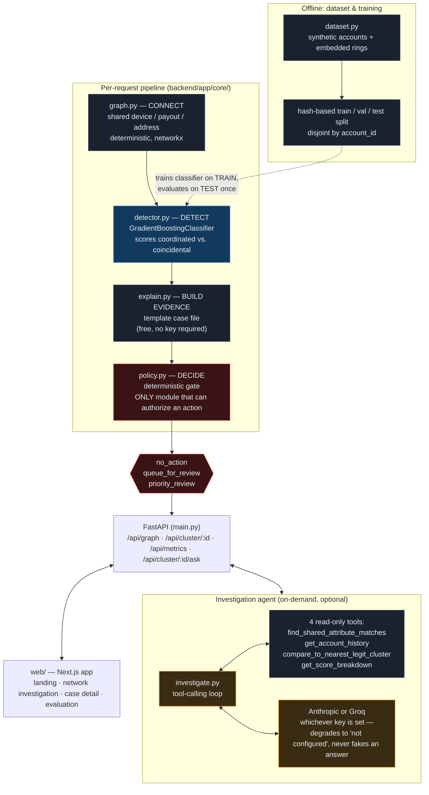

# Ring — Cross-Account Abuse Detection for Razorpay
### Razorpay AI Buildathon — Track 2: AI Risk Manager

**Most fraud tools score a transaction. Ring scores a relationship.** It builds a graph of accounts linked by a shared device, payout destination, or address, scores whether that link's *behavior* looks coordinated rather than coincidental, and hands a human reviewer a named, evidence-backed case file — never a ban, freeze, or auto-block. Full reasoning: [`docs/TRACK_DECISION.md`](docs/TRACK_DECISION.md), [`docs/GAP_ANALYSIS.md`](docs/GAP_ANALYSIS.md).

**Why this isn't a clone of Razorpay's own Thirdwatch** (which already does device-linked fraud detection and, per its public description, can act on its own): an auto-blocking system is explicitly disqualified by this track's rule ("anything offense-capable is disqualified"). Ring is the accountable layer that belongs where that black box sits today — same underlying signal, a structurally different guarantee. See [`docs/GAP_ANALYSIS.md`](docs/GAP_ANALYSIS.md) for the full, sourced argument.

## What's real here, honestly
- A synthetic dataset with embedded collusion rings, deliberately hard: legitimate accounts coincidentally share attributes (families, offices) sized to overlap with real ring sizes, so a naive "any shared attribute = fraud" rule loses.
- A held-out evaluation (train/val/test, disjoint by account) reported at `/api/metrics` and on the web app's Evaluation page — current numbers there, not hardcoded here, because the dataset is still being scaled and the exact figure moves. As of this writing: precision/recall in the high-90s/high-70s range depending on the current dataset scale; always check the live number.
- **A genuine negative result on real transaction data** ([`docs/REAL_DATA_ATTEMPT.md`](docs/REAL_DATA_ATTEMPT.md)): we tested this against real IEEE-CIS fraud data before trusting the synthetic numbers. It scored AUC ≈ 0.50 — chance level — and we documented exactly why (that public dataset has no real device/payout/address identifiers, only demographic buckets). That failure is evidence, not an embarrassment to hide: it shows this needs Razorpay's actual internal signals to work, which is the reason no outside vendor can replicate it either.
- A live, tool-calling investigation agent (Anthropic or Groq, whichever key is configured) that a reviewer can ask follow-up questions — answered by real read-only tool calls against the actual account graph, never a canned response, and structurally incapable of taking any action.

## Repository layout
```
backend/    FastAPI app: dataset generator, graph construction, classifier,
            deterministic policy engine, case-file reasoning, investigation
            agent, tests. See backend/README below.
web/        The actual product UI (Next.js) -- landing page, live network
            investigation view, case detail pages, evaluation dashboard.
            This is the frontend that matters.
frontend/   An earlier static-HTML prototype, superseded by web/. Kept for
            reference, not actively developed.
docs/       Track decision, gap analysis, business case, scale plan, the
            real-data negative result, pitch structure.
```

## Quickstart

**Backend:**
```bash
cd backend
python3 -m venv ../.venv && source ../.venv/bin/activate
pip install -r requirements.txt
PYTHONPATH=. python -m app.core.dataset       # generate synthetic accounts -> data/accounts.csv
PYTHONPATH=. python -m app.core.evaluation    # train classifier, run full held-out evaluation
uvicorn app.main:app --port 8421              # serves the API
```

**Frontend (the real one):**
```bash
cd web
npm install
npm run dev    # http://localhost:3000
```

**Investigation agent (optional):** copy `backend/.env.example` to `backend/.env` and set `ANTHROPIC_API_KEY` or `GROQ_API_KEY`. Neither is required — the core detection pipeline never calls out to any API; only the investigation assistant does, and only when a reviewer asks it something. Without a key it degrades to a clear "not configured" message, never a crash or a faked answer.

## Architecture



**Reading the colors**: gray = deterministic rules, blue = classical ML, orange = LLM (optional, narration/investigation only), red = the policy gate — the single module in this entire system allowed to authorize a financial-adjacent action. No LLM output and no ML score ever reaches a decision without passing through it.

Four stages, four different tools, because they're four different kinds of problem (full rationale in each module's docstring):

| Stage | Module | Tool | Why |
|---|---|---|---|
| Connect | `graph.py` | Deterministic (`networkx`) | Whether two accounts share an attribute is a fact, not a prediction |
| Detect | `detector.py` | ML (`GradientBoostingClassifier`) | Telling coordinated behavior from coincidence over noisy features is a real classification problem |
| Build evidence | `explain.py`, `investigate.py` | Template + optional LLM agent | Turning structured evidence into a human-readable argument is a language task; the agent's tools are all read-only |
| Decide | `policy.py` | Deterministic rules | The only module allowed to authorize a review action — `no_action`, `queue_for_review`, or `priority_review`. No ban/freeze/block exists anywhere in this codebase, not as a disabled feature — as code that was never written |

## Security notes
- Both LLM provider keys are read from environment/`.env` only, never logged, never returned in an API response, and `.env` is gitignored.
- The investigation agent's tool schema (`investigate.py::TOOL_SCHEMAS`) has no action-capable tool — not "the model is told not to act," there is no function for it to call.
- Every financial-adjacent decision passes through `policy.py`; the ML model and the LLM agent can only ever recommend or explain.

## Tests
```bash
cd backend && PYTHONPATH=. python -m pytest tests/ -v
```
Covers dataset split integrity, graph edge-weight logic, the classifier pipeline, the policy engine's guardrails (including adversarial cases), and the investigation agent's tools and provider routing (mocked — no real API calls in tests).

## Docs
- [`docs/TRACK_DECISION.md`](docs/TRACK_DECISION.md) — why Track 2, scored against the alternatives
- [`docs/GAP_ANALYSIS.md`](docs/GAP_ANALYSIS.md) — why this isn't a clone of Thirdwatch, sourced
- [`docs/BUSINESS_CASE.md`](docs/BUSINESS_CASE.md) — order-of-magnitude sizing, every number cited or labeled as an assumption
- [`docs/SCALE.md`](docs/SCALE.md) — honest plan for what changes at real account volume (not yet built)
- [`docs/REAL_DATA_ATTEMPT.md`](docs/REAL_DATA_ATTEMPT.md) — the negative result, and why it matters
- [`docs/PITCH.md`](docs/PITCH.md) — 5-minute demo structure

---
*Independent build for the Razorpay AI Buildathon, Track 2 — not an official Razorpay product.*
